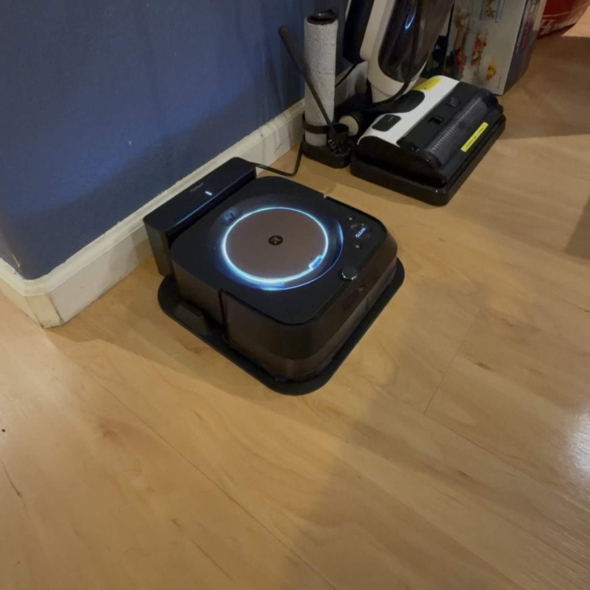
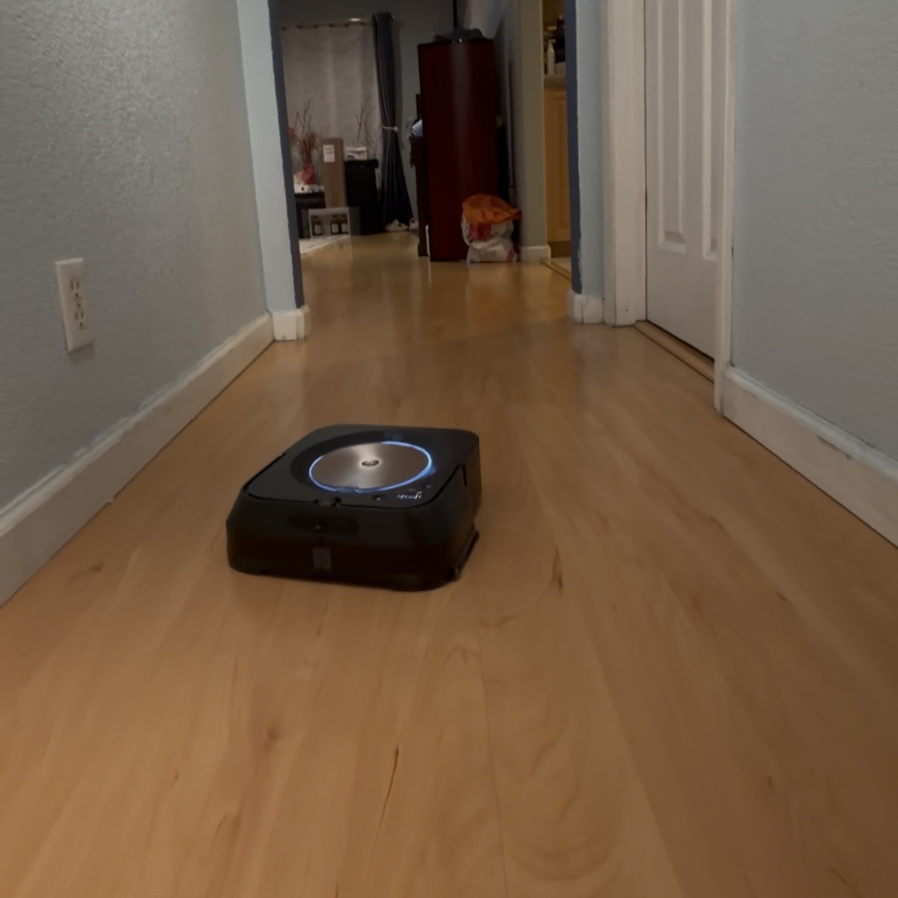

# Braava M6 Behavioral Evaluation

A QA evaluation framework for the iRobot Braava Jet M6 (6110) robot mop.
Connects directly to the robot over local MQTT using roombapy, polls real-time
state during cleaning missions, and logs structured data for systematic behavioral analysis.

## Why This Project

Physical AI systems need the same rigorous evaluation as software. This project
treats the M6 as a system under test — defining expected behavior, instrumenting
the system, and analyzing results across repeated runs using standard QA methodology.

## How It Works

The M6 broadcasts its internal state over local MQTT. This project uses roombapy
to connect directly over WiFi, intercept that stream, and poll the robot's state
at configurable intervals during live missions. Data is logged as timestamped JSON
per run and aggregated into a summary CSV for analysis.

See [docs/field_reference.md](docs/field_reference.md) for full documentation of
every field in the state blob.

## In Action

**On dock, awaiting mission:**


**Mapping freely during first run:**


**Wall interaction during navigation:**


## Test Cases

See [docs/test_plan.md](docs/test_plan.md) for full documentation.

| ID | Test | Environment | Status |
|----|------|-------------|--------|
| ~~TEST-001~~ | ~~Dock Return Reliability~~ | — | ~~Validated — excluded~~ |
| TEST-002 | Coverage Consistency | Hallway | ✅ Round 1 complete |
| TEST-003 | Obstacle Handling | Hallway | ✅ Round 1 complete |
| TEST-004 | Cliff Sensor Validation | Table | 🔄 In progress |


## Project Structure
```
braava-m6-eval/
├── scripts/
│   ├── connect.py            # verify connection and credentials
│   ├── collect_state.py      # poll and log state during live run (per-test configs)
│   ├── snapshot_profile.py   # capture robot baseline stats before/after runs
│   ├── analyze_results.py    # parse JSON logs and generate summary CSV
│   └── start_mission.py      # send start command programmatically (experimental)
├── docs/
│   ├── test_plan.md          # full test plan with 3 active test cases
│   ├── field_reference.md    # documentation of every field in the state blob
│   ├── initial_robot_profile.md  # frozen baseline before testing began
│   └── robot_profile.md      # updated after each snapshot_profile.py run
├── data/runs/                # JSON logs per run, organized by test ID (gitignored)
├── results/summary.csv       # aggregated results (committed)
├── images/                   # robot photos
├── requirements.txt
└── .env                      # credentials — never committed
```

## Setup

> ⚠️ Tested on Python 3.10. Connection instability observed on Python 3.13 —
> recommend using 3.10.
```bash
git clone https://github.com/MichaelNguyenz229/braava-m6-eval.git
cd braava-m6-eval
python -m venv venv
source venv/Scripts/activate  # Windows
# source venv/bin/activate    # Mac/Linux
pip install -r requirements.txt
```

Create `.env` with your robot credentials:
```
ROBOT_IP=192.168.X.X
BLID=your_blid
PASSWORD=your_password
```
```bash
python scripts/connect.py
```

## Usage
```bash
# Log state during a live mission
python scripts/collect_state.py --test TEST-002

# Capture robot baseline stats
python scripts/snapshot_profile.py

# Analyze all runs
python scripts/analyze_results.py

# Analyze specific test case
python scripts/analyze_results.py --test TEST-002
```

## Status

🔄 Active — Round 1 data collection in progress. Round 2 planned with stricter
preconditions and new obstacle course variations.

## Author

Michael Nguyen