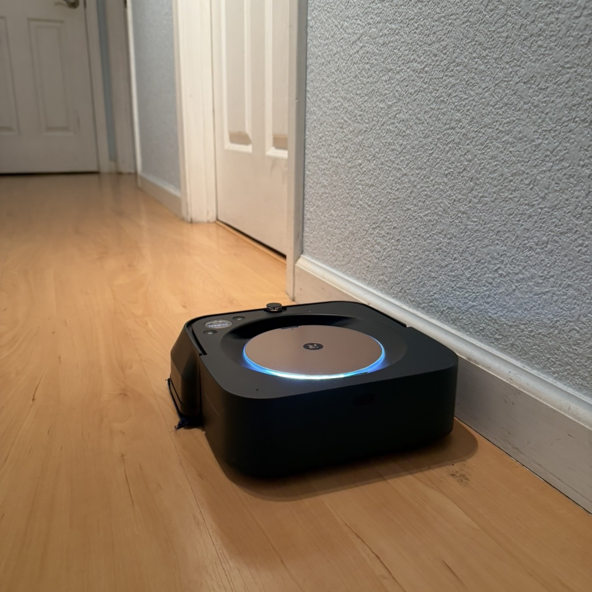
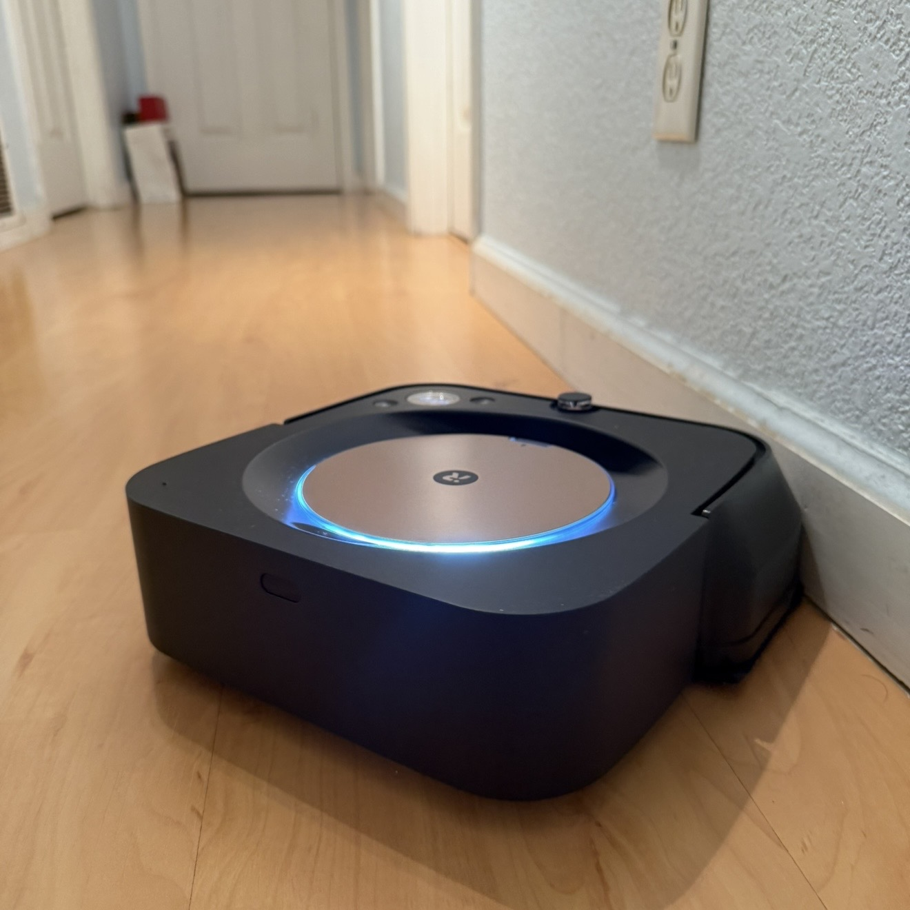

# Braava M6 — Test Plan

## Overview

Behavioral evaluation of the iRobot Braava Jet M6 (6110) in a real home environment.
Five focused test cases covering navigation reliability, coverage consistency,
obstacle handling, and safety-critical sensor validation.

---

## Test Environment

- **Device:** iRobot Braava Jet M6 (6110)
- **Location:** Single bedroom apartment
- **Primary test zone:** Dead-end hallway (~15ft), hardwood/tile surface
- **Secondary test zone:** Kitchen with obstacles (chair legs, trash bin, recycle bin, boxes)
- **Cliff test zone:** Near raised surface or step edge
- **Dock location:** Living room at hallway entrance
- **Map state:** No pre-existing map — robot builds from scratch
- **Data collection:** roombapy local MQTT, state polled every 5 seconds
- **Runs per test:** 3-5 runs

---

## Test Cases

### TEST-001: Dock Return Reliability

**Category:** Navigation
**Type:** Automated + Observation
**Priority:** High

**Why this matters:** The hallway is a dead end. The robot must navigate back out
and locate the dock in the living room after cleaning. Getting back is the real test.

**Preconditions:**
- Robot fully charged
- Dock in living room at hallway entrance
- Hallway clear of obstacles

**Steps:**
1. Start cleaning mission from iRobot app
2. Allow mission to complete naturally
3. Log final phase — did it reach "charge" state?
4. Record time from mission end to successful dock

**Pass criteria:** `phase == "charge"` within 3 minutes of mission end
**Fail criteria:** phase = "stuck" or "error", or robot cannot locate dock

---

### TEST-002: Coverage Consistency

**Category:** Performance
**Type:** Automated
**Priority:** High

**Why this matters:** A reliable robot should report consistent coverage across
identical runs of the same space. High variance suggests navigation inconsistency.

**Preconditions:**
- Same hallway layout across all runs
- Robot fully charged before each run
- No changes to environment between runs

**Steps:**
1. Run 3 cleaning missions on same hallway
2. Log sqft reported at end of each mission
3. Log mission duration per run
4. Calculate variance across runs

**Pass criteria:** sqft variance < 15% across runs
**Fail criteria:** Any run deviates > 25% from mean

---

### TEST-003: Obstacle Handling

**Category:** Navigation
**Type:** Manual Observation
**Priority:** Medium

**Why this matters:** Kitchen environment represents real-world complexity —
chair legs, bins, and boxes test the robot's ability to navigate tight spaces
with irregular obstacles.

**Preconditions:**
- Kitchen in normal state — no obstacles removed or added
- Chair legs, trash bin, recycle bin, boxes present
- Robot fully charged

**Steps:**
1. Start cleaning mission in kitchen
2. Observe and note behavior at each obstacle type
3. Record whether robot gets stuck, avoids, or navigates through

**Observation template per obstacle:**
```
Obstacle type:
Behavior observed:
Time spent:
Result: PASS / PARTIAL / FAIL
Notes:
```

**Pass criteria:** Mission completes without getting stuck
**Fail criteria:** Robot stuck requiring manual intervention

---

### TEST-004: Cliff Sensor Validation

**Category:** Safety
**Type:** Manual Observation
**Priority:** High

**Why this matters:** With 531 lifetime front cliff triggers and 0 rear triggers,
this sensor is heavily used and asymmetric. Validating consistent detection behavior
is critical — cliff sensors are a primary safety mechanism preventing falls.

**Preconditions:**
- Robot fully charged
- Clear path approaching a raised edge or step
- Observer ready to catch robot if sensor fails

**Steps:**
1. Note current `nCliffsF` value from snapshot_profile.py
2. Place robot on approach path toward edge
3. Allow robot to approach under its own navigation
4. Observe detection distance and response behavior
5. Record whether robot stopped, reversed, or panicked
6. Run snapshot_profile.py after — verify `nCliffsF` incremented

**Pass criteria:** Robot detects edge and reverses before crossing
**Fail criteria:** Robot crosses edge or requires manual intervention

**Hypothesis to investigate:** Does a cliff trigger increment `nCliffsF` only,
or does it also increment `nPanics`? Determines whether these are independent
event counters or overlapping.

---

### TEST-005: Bumper Collision Detection

**Category:** Safety
**Type:** Manual Observation + Automated
**Priority:** Medium

**Why this matters:** `nCBump = 0` despite 33 navigation panics and 7 stuck events
is suspicious. Either the M6 routes collision detection through the panic handler
instead of the bumper counter, or the bumper sensor has never been triggered.
This test directly investigates that hypothesis.

**Preconditions:**
- Robot fully charged
- Fixed obstacle placed in open space (box or chair)
- Note current `nCBump` and `nPanics` values before run
**Observed behavior (preliminary):**



**Steps:**
1. Run snapshot_profile.py — record baseline `nCBump` and `nPanics`
2. Place fixed obstacle in robot's path
3. Allow robot to approach and make contact
4. Observe behavior — does it bump, panic, or avoid?
5. Run snapshot_profile.py after — check which counters incremented

**Pass criteria:** `nCBump` increments after confirmed physical contact
**Fail criteria:** Physical contact occurs but only `nPanics` increments —
confirms collision events are routed through panic handler, not bumper counter

**Note:** Either outcome is a valid finding. The goal is to understand
which counter accurately reflects physical collisions.

---

## Results Tracking

Results logged per run in `data/runs/` as timestamped JSON files.
Manual observations recorded in `data/runs/observations.md`.
Aggregated in `results/summary.csv`.

---

## Failure Mode Taxonomy

| Category | Description | Test |
|----------|-------------|------|
| Dock failure | Cannot locate or return to dock | 001 |
| Coverage gap | Significant area missed or inconsistent | 002 |
| Obstacle stuck | Robot requires manual rescue | 003 |
| Cliff detection failure | Robot crosses edge without stopping | 004 |
| Bumper miscount | Physical collision not reflected in nCBump | 005 |
| Navigation loop | Robot repeatedly revisits same area | 001, 002 |